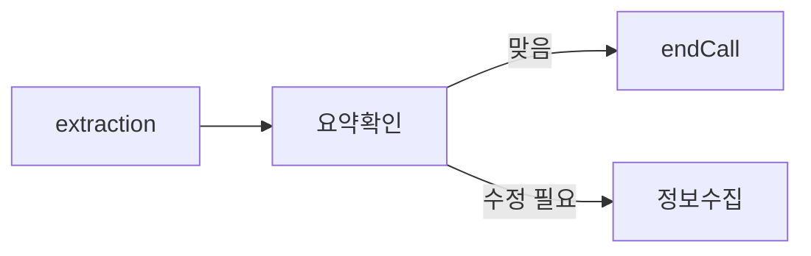
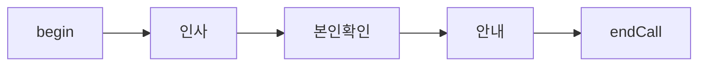
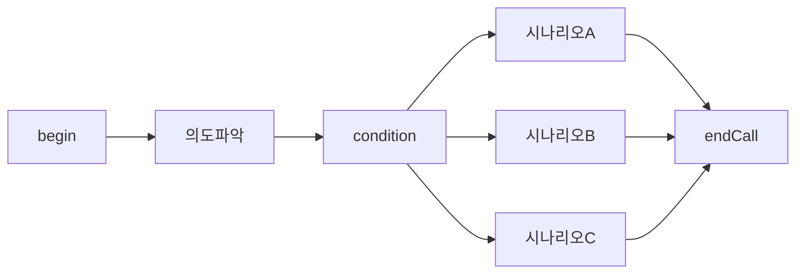
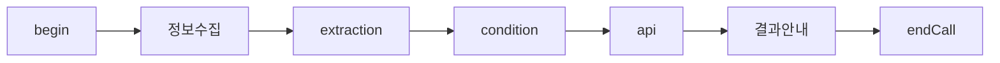
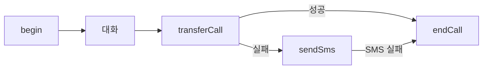

# Flow 설계 통합 가이드

vox.ai flow agent 의 구조와 설계 원칙을 이해하기 위한 가이드. flow 를 처음 설계하거나, 기존 flow 를 수정할 때 읽는다.

> 규칙의 정본은 `vox-flow/SKILL.md`의 Core Operating Rules다. 이 문서의 서술이 그 규칙과 다르면 SKILL.md가 우선하고, 이 문서를 고친다.

## 목차

- [Schema-first workflow](#schema-first-workflow)
- [Public Flow Shape](#public-flow-shape) — Agent 최상위 `data` 와 `flow` / FlowNode / FlowEdge
- [Edge Conditions](#edge-conditions) — AI / Logic / Fallback
- [Global Node](#global-node)
- [변수 흐름](#변수-흐름) — 생성 / 소비
- [설계 원칙](#설계-원칙) — 노드 수 최소화 · 한 노드 한 목적 · Fallback 경로 · Extraction 전 Conversation · 요약 확인 turn · Condition 은 logic 전용
- [설계 패턴](#설계-패턴) — Linear / Branching / Data Collection / Transfer Fallback
- [API / MCP 로 Flow 만들고 수정](#api--mcp-로-flow-만들고-수정) — 생성 / 수정 / Legacy `flow_data` / 조회
- [Round-trip 검증](#round-trip-검증)

본 가이드는 v3 API / vox.ai MCP 의 public `flow` workflow 기준이다. 정확한 node type, data field, enum, required 여부는 문서에 고정하지 않고 MCP schema endpoint 결과를 따른다.

## Schema-first workflow

flow JSON 을 작성하거나 수정할 때는 먼저 현재 schema 를 가져온다. default 는 `flow-data` minimal 한 번이다. 이 한 응답에 public `flow` graph, edge condition, 모든 node type 의 `data` shape 가 함께 들어온다.

```text
get_schema(namespace="flow-schema", schema_type="flow-data", detail="minimal")
```

`detail="minimal"` 을 명시한다. api / transferCall / transferAgent / sendSms / tool 처럼 설명 문구가 중요한 node type 은 SKILL.md [Schema Fetching](../SKILL.md#schema-fetching)에 따라 해당 type 만 standard 모드로 보강한다.

agent `data` 도 같이 다루면 필요한 schema 를 별도로 가져온다.

```text
get_schema(namespace="agent-schema", schema_type="agent-data-create", detail="minimal")
get_schema(namespace="agent-schema", schema_type="agent-data-update", detail="minimal")
```

이 문서와 `node-types.md` 는 설계 원칙과 실수 방지용이다. 실제 payload 는 schema endpoint 응답을 기준으로 만들고, 전송 후 `get_agent` 로 round-trip 확인한다.

## Public Flow Shape

flow 는 nodes 와 edges 로 이루어진 방향 그래프다.

```text
Flow {
  nodes: FlowNode[]
  edges: FlowEdge[]
}
```

### Agent 최상위 `data` 와 `flow`

`create_agent` / `update_agent` payload 의 최상위 구조는 다음과 같다:

```jsonc
{
  "name": "<agent name>",
  "type": "flow",
  "data": {
    // 에이전트 단위 prompt/voice/llm/stt 설정.
    // override 안 하는 sub-schema 는 OMIT 한다.
  },
  "flow": { "nodes": [...], "edges": [...] }
}
```

**자주 틀림**: agent 최상위 `data.prompt` 는 객체이고, flow node 의 `data.prompt` 는 conversation node 안의 문자열이다. 서로 다른 필드다. flow agent 는 보통 conversation node 의 `data.prompt` 가 노드별 system prompt 를 담당하므로, 최상위 `data.prompt` 는 비워 두거나 통화 전반 공통 지시만 아주 짧게 둔다.

flow graph 만 만들거나 검증하는 작업이면 agent 최상위 `data` 를 보내지 않는다. 사용자가 agent-level prompt/voice/llm/stt 설정을 요구했을 때만 `agent-schema` 를 확인하고 필요한 subtree 만 보낸다. schema 에 보이는 값이라는 이유로 `data.stt.speed:"high"`, `llm`, `voice`, `speech` 같은 기본값을 복사하지 않는다.

`flow_data` 는 deprecated legacy graph 다. 새 작성에는 `flow` 를 사용한다.

### FlowNode

```text
FlowNode {
  id: string
  type: NodeType
  position: { x, y }
  data: NodeData
}
```

- `position` 은 모든 노드에서 필수다. 서버가 좌표를 만들어 주지 않는다.
- 레이아웃은 가로 정렬이 기본이다. happy path 는 좌→우로 흐르게 두고, 분기/병렬 경로만 위아래로 벌린다.
  - 권장 spacing: `x += 320`, 분기 spacing `y ± 240`.
  - 예시: `begin {x:0,y:0}` → `extraction {x:320,y:0}` → `api {x:640,y:0}` → 성공 `endCall {x:960,y:-120}`, 실패 `transferCall {x:960,y:120}`.
- node `data` 는 node type 별 실행 설정이다. Public `flow` node data 는 snake_case 를 쓴다. 예: `prompt_type`, `static_sentence`, `api_configuration`, `response_variables`, `extraction_configuration`, `transfer_configuration`, `agent`, `tool_id`.
- public `flow` 의 node `data` 에 legacy routing key 를 넣지 않는다: `transitions`, `logicalTransitions`, `globalNodeSettings`.
- global node 는 `data.global_node_setting` 으로 표시한다. legacy `globalNodeSettings` 를 보내지 않는다.

### FlowEdge

```text
FlowEdge {
  id?: string
  source: string
  target: string
  condition: EdgeCondition
  skip_user_response?: boolean
}
```

- edge `id` 는 생략 가능하다. 제공하면 빈 문자열이 아니어야 하며, 기존 edge 수정 시 가능하면 보존한다.
- `source` / `target` 은 node id 를 가리킨다.
- legacy edge field 를 보내지 않는다: `sourceHandle`, `targetHandle`, `type:"custom"`, `animated`, `selected`.
- `skip_user_response` 는 이 edge 에서 사용자 응답을 기다리지 않고 다음 node 로 진행해야 할 때만 쓴다. static conversation → endCall, 실패 fallback edge 에 습관적으로 붙이지 않는다.
- `begin` 에서 첫 실행 node 로 나가는 edge 에는 `skip_user_response:true` 를 붙이지 않는다. 시작 edge 는 flow wakeup 자체이며 사용자 응답 skip 의미를 덧씌우지 않는다.
- extraction 완료, static one-shot 안내 후 다음 단계, API 성공 후 일반 진행처럼 정상 진행이 확정된 edge 를 fallback 으로 표현하지 않는다. schema 가 허용하는 명시 condition 으로 진행 의미를 적고, fallback 은 실패/else/default 복구 path 에 남긴다.
- begin 으로 들어가는 edge, endCall 에서 나가는 edge, note 로 들어가거나 note 에서 나가는 edge 는 만들지 않는다.
- condition node 에서 나가는 edge 는 `logic` 또는 `fallback` condition 만 사용한다. 고객 발화 판단은 conversation node 의 `ai` condition edge 로 보낸다.

## Edge Conditions

분기 의미는 `edges[].condition` 에 둔다.

### AI condition

자연어 route condition 이다. conversation node 의 out-edge 에서는 고객 발화를 LLM 이 판단하는 조건으로 쓰고, api / tool / sendSms / transfer 계열 node 의 일반 성공 edge 에서는 `"요청 성공 시"` 같은 경로 라벨로 쓴다. 응답 변수 값을 비교해야 하면 다음 condition node 로 보내고 `logic` condition 을 사용한다.

```json
{
  "source": "conversation",
  "target": "next",
  "condition": {
    "type": "ai",
    "prompt": "고객이 예약 의사를 밝힌 경우"
  }
}
```

### Logic condition

이미 추출된 변수 값을 deterministic logic 으로 비교한다. source 는 condition node 로 둔다.

```json
{
  "source": "condition_check",
  "target": "eligible",
  "condition": {
    "type": "logic",
    "operator": "&&",
    "equations": [
      { "left": "is_verified", "operator": "equals", "right": true }
    ]
  }
}
```

- `left` 는 앞선 extraction/API/preset variable 이름이다.
- `operator` 값은 schema endpoint 의 enum 을 따른다.
- `exists` / `does_not_exist` 류 operator 는 `right` 를 생략하거나 null 로 둔다.
- 여러 조건을 묶을 때 `operator:"&&"` 또는 `"||"` 를 쓴다.

### Fallback condition

같은 source node 의 다른 조건이 매치되지 않거나 실행 실패 시 default path 로 간다.

```json
{
  "source": "api_lookup",
  "target": "api_failure_apology",
  "condition": { "type": "fallback" }
}
```

fallback 은 자동으로 생긴다고 가정하지 않는다. 필요한 실패/else/default path 는 `edges` 로 명시한다.

## Global Node

"통화 종료 요청", "상담원 연결 요청" 같이 어디서든 발생할 수 있는 시나리오는 global node 로 설정한다. 모든 노드에 개별 전환을 추가하는 것보다 유지보수가 쉽다.

```json
{
  "id": "global_end",
  "type": "endCall",
  "position": { "x": 960, "y": 360 },
  "data": {
    "name": "종료 요청",
    "prompt_type": "static",
    "static_sentence": "알겠습니다. 통화를 종료하겠습니다.",
    "global_node_setting": {
      "condition": {
        "type": "ai",
        "prompt": "고객이 통화 종료를 요청한 경우"
      }
    }
  }
}
```

- global enter condition 은 고객 발화 기반으로 쓴다.
- global node 는 현재 public contract 상 conversation / sendSms / endCall 에서만 설정한다. begin, api, condition, extraction, transferCall, transferAgent, tool, note 에 `global_node_setting` 을 넣지 않는다.
- 2-3개 이내로 제한한다. 너무 많으면 전환 충돌 위험이 커진다.
- global node 로 들어가는 entry edge 를 직접 펼쳐 넣지 않는다.

## 변수 흐름

flow 에서 변수는 노드 간 데이터를 전달하는 핵심 메커니즘이다.

### 변수 생성

| 방법 | 노드 | 설명 |
|---|---|---|
| system | (자동) | `{{current_time}}`, `{{call_from}}`, `{{call_to}}` 등 플랫폼 제공 |
| agent 설정 | (사전 주입) | `{{customer_name}}` 등 통화 시작 전 주입 (`agent.data.presetDynamicVariables`) |
| extraction | extraction 노드 | LLM 이 대화에서 추출 → flow 변수로 저장 |
| api response | api 노드 | JSONPath 로 API 응답에서 추출 |

### 변수 소비

| 위치 | 사용법 |
|---|---|
| conversation `data.prompt` / `data.static_sentence` | `{{customer_name}}님의 주문을 확인합니다` |
| api `data.api_configuration.url` / `body` | `https://api.example.com/orders/{{order_id}}` |
| edge `condition` | logic condition 의 `left`, ai condition 의 prompt |
| extraction `data.extraction_configuration.extraction_prompt` | `{{customer_name}} 의 주문번호를 추출하세요` |
| sendSms `data.prompt` / `data.static_sentence` | `{{customer_name}}님 예약이 확정되었습니다` |

사용자에게 말하는 문구에는 내부 제어 변수를 그대로 넣지 않는다. `is_emergency`, `address_complete`, `access_allowed`, `access_permission_provided` 같은 boolean/control variable 은 condition node 의 logic branching 용이다. 종료 요약에서 상태를 말해야 하면 `{{is_emergency}}` 를 읽히게 하는 대신 "물이나 전기 위험 여부는 말씀해 주신 내용 기준으로 함께 남기겠습니다"처럼 자연어로 쓰거나, 별도 string summary variable 을 추출해 읽는다.

상세는 `vox-agents` 스킬이 소유한다(변수 시스템 reference) — 필요하면 `vox-agents` 스킬을 호출한다.

## 설계 원칙

### 1. 노드 수 최소화

불필요한 분할은 edge 관리를 복잡하게 하고 유지보수 비용이 증가한다. 한 conversation 노드가 한 목적을 처리하되, 관련된 확인/재질문은 같은 노드의 loop condition 으로 처리한다.

### 2. 한 노드 = 한 목적

각 노드가 하나의 명확한 목적을 가져야 한다. "인사 + 본인확인 + 안내" 를 하나에 넣으면 전환 조건이 복잡해지고 디버깅이 어려워진다.

### 3. Fallback 경로 확보

실패/else/default path 가 필요한 source node 에는 fallback edge 를 명시한다.

- condition node: logic edge 외 default edge 1개.
- api / tool / sendSms node: 성공 path 외 실패 fallback edge 1개.
- transferAgent / transferCall node: 실패 fallback edge 1개.
- conversation node: 예상 외 응답 path 는 보통 fallback 이 아니라 ai condition 으로 명시한다. 예: "고객이 거절했거나 통화를 끊으려는 경우".
- api / tool / sendSms / transferCall / transferAgent node: 성공/일반 path 는 ai condition 으로 명시하고, 실패 path 는 fallback edge 로 명시한다. API 응답 변수 비교는 다음 condition node 에서 logic edge 로 처리한다.
- extraction node / static one-shot conversation node: 정상 진행 edge 를 fallback 으로 만들지 않는다. "추출 완료 후 다음 단계로 진행", "안내 멘트 발화 후 다음 단계로 진행"처럼 명시 condition 을 둔다.
- begin node: 첫 실행 node 로 fallback edge 하나를 둘 수 있지만 `skip_user_response:true` 는 붙이지 않는다.
- endCall node 와 note node 에서 나가는 edge 는 두지 않는다. note node 는 editor-only annotation 이므로 실행 흐름에 연결하지 않는다.

### 4. Extraction 전에 Conversation

extraction 노드는 기존 대화 컨텍스트에서 추출한다. 필요한 정보가 대화에 아직 없으면 extraction 이 빈 값을 반환한다. 반드시 conversation 노드에서 정보를 수집한 후 extraction 을 배치한다.

conversation 에서 필요한 정보가 모두 모였으면 "확인했습니다. 진행하겠습니다" 같은 중간 발화로 같은 노드에 머물지 말고 즉시 extraction 으로 전환되도록 prompt 와 edge condition 을 작성한다.

### 5. 요약 확인은 실제 확인 turn

수집한 정보를 고객에게 확인받아야 하는 flow 는 terminal summary 로 끝내지 않는다. endCall 멘트는 이미 종료 직전이라 고객이 수정할 기회가 없다.

권장 흐름:



요약확인 conversation node 는 수집값을 짧게 읽고 "맞으면 진행, 틀리면 수정"을 물어본다. 확인 edge 와 수정 edge 를 모두 둔다.

### 6. Condition 노드는 logic 분기 전용

condition 노드는 이미 만들어진 변수 값을 비교한다. 고객 발화의 동의/거절 판단은 conversation out-edge 의 ai condition 으로 처리한다.

## 설계 패턴

### Linear



분기 없이 순서대로 진행한다.

### Branching



고객 발화는 conversation 에서 판단하고, 변수 값 비교는 condition node 에서 처리한다.

### Data Collection



고객 정보 수집 → 변수 추출 → 조건 확인 → 외부 조회 → 결과 안내.

### Transfer Fallback



통화 전환 실패 시 fallback edge 로 콜백 안내 SMS 를 시도할 수 있다. SMS 가 실패하면 endCall 종료 멘트에서 "문자는 실패했지만 콜백 접수/예상 연락 시간은 본 통화로 안내"를 직접 말하고 종료한다.

## API / MCP 로 Flow 만들고 수정

새 작성/수정은 `flow` 를 사용한다. `flow_data` 는 legacy graph 이며 새 작성에는 사용하지 않는다.

작업 순서는 **schema 조회 → fill → validate → save** 로 고정한다.

flow graph 만 다루는 작업이면 agent 최상위 `data` 를 생략한다. agent-level 설정까지 바꿀 때만 `agent-schema` 를 확인하고, 사용자가 의도한 subtree 만 보낸다.

1. `get_schema(namespace="flow-schema", schema_type="flow-data", detail="minimal")` 로 현재 flow schema 를 확인한다.
2. agent `data` 를 보낼 경우 `get_schema(namespace="agent-schema", schema_type="agent-data-create", detail="minimal")` 또는 `agent-data-update` 를 확인한다.
3. schema 결과 기준으로 `nodes[]`, `edges[]`, node `data` 를 채운다. field 이름, enum, required 여부는 schema 결과를 따른다.
4. `validate_flow(flow=..., level="all")` 로 dry-run 한다.
5. blocking `errors` 가 없을 때 `create_agent(type="flow", data=..., flow=...)` 또는 `update_agent(flow=...)` 를 호출한다.
6. `get_agent` 로 다시 읽어 unknown field drop, enum mismatch, 누락 edge 를 확인한다.

`update_agent`에는 앞서 읽은 `expected_head_revision`을 항상 전달한다. Flow 전체를 바꾸면
같은 응답의 `flow_revision`도 `expected_flow_revision`으로 전달한다. `REVISION_CONFLICT`를
자동 재시도하지 않는다.

기존 flow 를 수정할 때 `get_agent` 결과에 `function` 또는 legacy `knowledge` node 가 보일 수 있다. 이 node 들은 호환성을 위해 read 에는 노출되지만 public `flow` write 에서는 거절된다. `update_agent(flow=...)` 전에 `function`은 `tool`/`api`로, legacy `knowledge`는 conversation node-level knowledge 설정으로 마이그레이션한다.

### 생성

REST:

```jsonc
POST /v3/agents
{
  "name": "My Flow Agent",
  "type": "flow",
  "data": { ... },
  "flow": { "nodes": [...], "edges": [...] }
}
```

vox.ai MCP:

```text
create_agent(
  name="My Flow Agent",
  type="flow",
  data={ ... },
  flow={ "nodes": [...], "edges": [...] }
)
```

### 수정

REST:

```jsonc
PATCH /v3/agents/{id}
{
  "expected_head_revision": 17,
  "expected_flow_revision": 4,
  "flow": { "nodes": [...], "edges": [...] }
}
```

예시 revision 값은 설명용입니다. 실제 값은 직전 `GET /v3/agents/{id}?version=current` 응답에서 확인하세요.

vox.ai MCP:

```text
update_agent(
  agent_id="<UUID>",
  expected_head_revision=<get_agent.head_revision>,
  expected_flow_revision=<get_agent.flow_revision>,
  flow={ "nodes": [...], "edges": [...] }
)
```

`flow` 는 전체 graph replacement 다. 일부만 빼면 그 노드/엣지가 삭제된다. 기존 flow 를 수정할 때는 `get_agent` 로 받은 current `flow` 를 기반으로 변경하지 않는 nodes/edges 를 그대로 보존한다. 단, current `flow` 안의 deprecated node(`function`, legacy `knowledge`)는 그대로 보존해도 public `flow` save 에서 거절되므로 먼저 마이그레이션해야 한다.

### Legacy `flow_data`

`validate_flow_data`와 `autofix_flow_data`는 legacy `flow_data` graph용 검증 도구다. 현재 `update_agent_partial` 이름은 비활성화되어 클라이언트가 로컬에서 거부하며 API 요청을 보내지 않는다. 기존 legacy graph를 유지해야 할 때만 `update_agent(flow_data=전체_그래프, expected_head_revision=...)`로 전체 교체한다. 새 작성에는 사용하지 않는다.

### 조회

REST:

```text
GET /v3/agents/{id}
```

vox.ai MCP:

```text
get_agent(agent_id="<UUID>")
```

flow agent 응답에는 public `flow` 가 포함된다. `flow_data` 가 같이 보일 수 있어도 deprecated compatibility field 로 취급한다.

## Round-trip 검증

전송 후 항상 `get_agent` 로 결과를 다시 비교한다.

- 보낸 node/edge 수가 유지됐는가?
- edge `condition` 과 `skip_user_response` 가 의도대로 남았는가?
- node `data` 의 핵심 필드가 schema 기준으로 유지됐는가?
- 기존 flow 수정이라면 변경하지 않은 edge id / node id 를 보존했는가?

응답에서 사라진 field 가 있다면 로컬 문서를 고치려 들기 전에 schema endpoint 결과와 payload 를 다시 대조한다.
