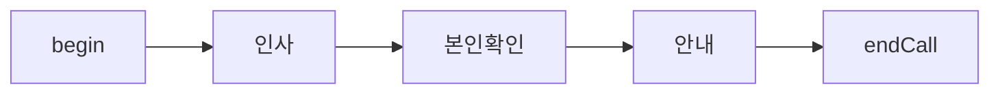
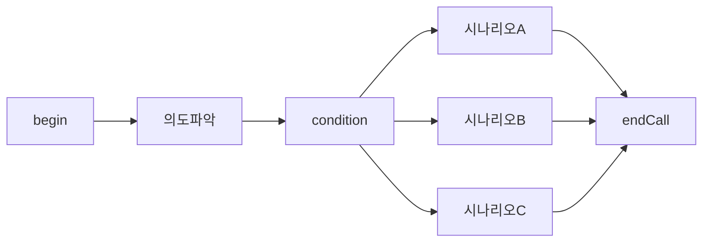
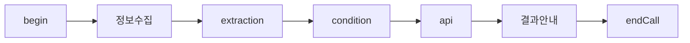
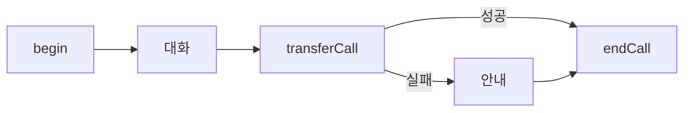

# Flow 설계 통합 가이드

vox.ai flow agent 의 구조와 설계 원칙을 이해하기 위한 가이드. flow 를 처음 설계하거나, 기존 flow 를 수정할 때 읽는다.

본 가이드는 **v3 API / vox.ai MCP `flow_data` workflow** 기준이다. 정확한 node type, data field, enum, required 여부는 문서에 고정하지 않고 MCP schema endpoint 결과를 따른다.

## Schema-first workflow

flow JSON 을 작성하거나 수정할 때는 먼저 현재 schema 를 가져온다.

```text
get_schema(namespace="flow-schema", schema_type="flow-data")
```

agent `data` 도 같이 다루면 필요한 schema 를 별도로 가져온다.

```text
get_schema(namespace="agent-schema", schema_type="agent-data-create")
get_schema(namespace="agent-schema", schema_type="agent-data-update")
```

이 문서와 `node-types.md` 는 설계 원칙과 실수 방지용이다. 실제 payload 는 schema endpoint 응답을 기준으로 만들고, 전송 후 `get_agent` 로 round-trip 확인한다.

## v3 Flow Schema

flow 는 **nodes** (노드 목록) 와 **edges** (연결 목록) 로 이루어진 방향 그래프다.

```
FlowData {
  nodes: FlowNode[]
  edges: FlowEdge[]
}
```

현재 API/MCP 저장 surface 는 flow builder 와 같은 **camelCase** 필드를 사용한다. 클라이언트가 unknown 필드를 보내면 서버가 보정하거나 drop 할 수 있으므로, 보낸 뒤에는 반드시 `get_agent` 로 round-trip 결과를 확인한다.

> **주의 (자주 틀림)**: `apiConfiguration`, `responseVariables`, `extractionConfiguration`, `transferConfiguration`, `logicalTransitions`, `isSkipUserResponse`, `isFallback`, `staticSentence`, `firstMessage`, `firstLineType`, `promptType` 등은 모두 camelCase 다. snake_case (`api_configuration`, `response_variables`, `is_skip_user_response`, ...) 로 보내면 v3 서버가 거절하거나 unknown 으로 drop 한다.

### Agent 최상위 `data` (flow_data 와 별개)

`create_agent` / `update_agent` payload 의 최상위 구조는 다음과 같다:

```jsonc
{
  "name": "<agent name>",
  "type": "flow",
  "data": {                     // 에이전트 단위 prompt/voice/llm/stt 설정
    "prompt": {                 // 객체 — 문자열이 아니다
      "prompt": "<system prompt>",
      "firstLine": "",
      "firstLineType": "aiFirstDynamic"
    }
    // voice/llm/stt 등은 default-agent-data.json 참조 (vox-agents/references)
  },
  "flow_data": { "nodes": [...], "edges": [...] }
}
```

**자주 틀림**: `data.prompt` 는 객체다. 문자열 (`"data": {"prompt": "..."}`) 로 보내면 v3 서버가 `model_attributes_type` 으로 reject 한다. flow agent 는 보통 conversation 노드의 `data.prompt` (string) 가 노드별 system prompt 를 담당하므로, 최상위 `data.prompt.prompt` 는 빈 문자열로 두거나 통화 전반에 공통으로 깔리는 가벼운 한 문장만 둔다.

flow node 의 `data.prompt` (string) 와 agent 의 `data.prompt` (object) 는 서로 다른 필드다. 헷갈리지 말 것.

기본 schema 의 가장 작은 합법 flow → [default-flow-data.json](default-flow-data.json) 참조.

### FlowNode

```
FlowNode {
  id: string                  // flow 안에서 unique. 1..64 chars.
  type: NodeType              // schema endpoint 의 enum 기준
  position: { x, y }          // 픽셀 좌표 — 필수. 빠지면 NODE_POSITION_REQUIRED.
  data: NodeData              // type 별 schema 는 schema endpoint 기준
}
```

- 노드 사이의 분기는 source node 의 `data.transitions[]` / `data.logicalTransitions[]` 에 둔다. edge 는 어떤 transition row 에 연결되는지만 `sourceHandle` 로 가리킨다.
- `position` 은 ReactFlow 가 사용하는 픽셀 좌표라서 모든 노드에 필수다 (`{x: number, y: number}`). 값이 없거나 숫자가 아니면 `NODE_POSITION_REQUIRED` / `NODE_POSITION_INVALID` 로 거절된다.
- **레이아웃은 가로 정렬 (horizontal layout) 이 기본이다.** flow 전체를 좌→우로 흐르게 두고 (`y` 는 0 근방으로 유지, `x` 는 320px 단위로 증가), 분기/병렬 경로만 위/아래 (`y±240`) 로 분기시킨다. 트리 모양으로 위→아래 쌓지 말 것 — vox.ai 에디터는 가로 흐름을 전제로 화면 폭을 잡는다.
  - 권장 spacing: 가로 step `x += 320`, 분기 spacing `y ± 240` (+ 아래쪽, - 위쪽).
  - 예시: `begin {x:0,y:0}` → `extraction {x:320,y:0}` → `api {x:640,y:0}` → 성공 `endCall {x:960,y:-120}`, 실패 `transferCall {x:960,y:120}`.
- 모든 노드의 `data` 에는 공통 필드 `name?` (에디터 라벨) 과 `global?: GlobalConfig` (값이 있으면 global node — 어디서든 진입) 이 있다.

### FlowEdge

```
FlowEdge {
  id: string
  source: string              // 출발 node.id
  target: string              // 도착 node.id
  type: "custom"
  sourceHandle: string
  targetHandle: string
}
```

- edge `id` 는 flow 안에서 unique 하게 둔다.
- `type` 은 항상 `"custom"` 으로 보낸다.
- `targetHandle` 은 보통 `{targetNodeId}-target` 이다.
- **begin node 에서 나가는 edge 의 `sourceHandle` 은 transition id 가 아니다.** web editor 의 고정 handle 인 `{beginNodeId}-source` 를 사용한다. 일반적인 시작 노드 id 가 `begin` 이면 `begin-source`.
- begin 이 아닌 source node 의 `sourceHandle` 은 source node 의 `data.transitions[].id` 또는 `data.logicalTransitions[].id` 중 하나와 정확히 일치해야 한다.

### Transition rows (분기 본진)

현재 저장 surface 에서는 `edge.condition` 을 쓰지 않는다. 분기 의미는 source node 의 transition row 에 있고, edge 는 `sourceHandle` 로 해당 row 를 연결한다.

**(1) AI/natural-language transition** — LLM 이 자연어 조건으로 판단.

```
{ "id": "tr_confirmed", "condition": "고객이 예약 의사를 밝힌 경우" }
```

conversation 노드의 out-edge 에서 가장 흔히 쓴다.

**(2) Logical transition** — 변수 값 기반 결정적 분기.

```
{
  "id": "lt_available",
  "condition": {
    "logicalOperator": "and",
    "conditions": [
      { "variable": "available", "operator": "equals", "value": "True" }
    ]
  }
}
```

condition 노드 또는 api 노드 응답 변수 분기에서 주로 쓴다.

**(3) Fallback transition** — 같은 source 노드의 다른 transition 이 매치 안 되거나 실행 실패할 때 default.

```
{
  "id": "tr_fail",
  "condition": "요청 실패 시",
  "isFallback": true
}
```

api / function / tool / sendSms 는 `"요청 실패 시"`, transferAgent / transferCall 은 `"에러 발생 시"`를 쓴다.

### Per-edge 패턴 정리

- **begin → first node**: edge `sourceHandle` 은 `begin-source`.
- **conversation → next**: source node `data.transitions[]` 에 자연어 `condition` row 를 만들고, edge `sourceHandle` 을 그 row id 로 둔다.
- **condition → branch**: source node `data.logicalTransitions[]` 에 logic row 를 만들고, fallback 은 `data.transitions[]` 에 `isFallback:true` row 로 둔다.
- **api / tool → success / failure**: 성공 path 는 success/logical transition row, 실패 path 는 canonical fallback transition row 로 둔다.

## 변수 흐름

flow 에서 변수는 노드 간 데이터를 전달하는 핵심 메커니즘.

### 변수 생성

| 방법 | 노드 | 설명 |
|---|---|---|
| system | (자동) | `{{current_time}}`, `{{call_from}}`, `{{call_to}}` 등 플랫폼 제공 |
| agent 설정 | (사전 주입) | `{{customer_name}}` 등 통화 시작 전 주입 (`agent.data.presetDynamicVariables`) |
| extraction | extraction 노드 | LLM 이 대화에서 추출 → flow 변수로 저장. 변수 정의는 `extractionConfiguration.variables[]` 의 `variableName` / `variableType` / `variableDescription` |
| api response | api 노드 | JSONPath 로 API 응답에서 추출. 매핑은 `responseVariables[]` 의 `variableName` / `jsonPath` |

### 변수 소비

| 위치 | 사용법 |
|---|---|
| conversation `data.message.content` | `{{customer_name}}님의 주문을 확인합니다` |
| api `data.apiConfiguration.url` / `body` | `https://api.example.com/orders/{{order_id}}` |
| `data.transitions[].condition` / `data.logicalTransitions[].condition.conditions[].variable` | `{{is_verified}} 가 true 인 경우` 등 |
| extraction `data.extractionConfiguration.extractionPrompt` | `{{customer_name}} 의 주문번호를 추출하세요` |
| sendSms `data.prompt` (dynamic) / `data.staticSentence` (static) | `{{customer_name}}님 예약이 확정되었습니다` |

### 일반적인 변수 흐름 패턴

```
conversation → extraction → condition → api → conversation
(정보 수집)   (변수 추출)   (조건 분기)  (조회)  (결과 안내)
```

상세 → `variable-system.md` (vox-agents/references/) 참조.

## 설계 원칙

### 1. 노드 수 최소화

불필요한 분할은 edge 관리를 복잡하게 하고 유지보수 비용이 증가한다. 한 conversation 노드가 한 목적을 처리하되, 관련된 확인/재질문은 같은 노드의 `loop_condition` 으로 처리한다.

### 2. 한 노드 = 한 목적

각 노드가 하나의 명확한 목적을 가져야 한다. "인사 + 본인확인 + 안내" 를 하나에 넣으면 전환 조건이 복잡해지고 디버깅이 어려워진다.

### 3. Global 노드 활용

"통화 종료 요청", "상담원 연결 요청" 같이 어디서든 발생할 수 있는 시나리오는 global node 로 설정한다. 모든 노드에 개별 전환을 추가하는 것보다 유지보수가 쉽다. 활성화 = `data.global` 에 `{enter_condition: "…"}` 를 넣는다 (값이 없으면 global 아님).

### 4. Fallback 경로 확보

모든 분기 source 노드에 fallback transition 과 edge 가 있어야 한다:
- condition 노드: 모든 logical transition 외에 `data.transitions[]` fallback row 1 개.
- api / function / tool / sendSms 노드: 성공 path 외에 `"요청 실패 시"` fallback row 1 개.
- transferAgent / transferCall 노드: `"에러 발생 시"` fallback row 1 개.
- conversation 노드: 예상 외 응답 path. 보통 `"고객이 거절했거나 통화를 끊으려는 경우"` 같은 자연어 transition row.
- begin 노드: 단일 edge 로 첫 실행 노드에 연결하고 `sourceHandle` 은 `begin-source`.

### 5. Extraction 전에 Conversation

extraction 노드는 기존 대화 컨텍스트에서 추출한다. 필요한 정보가 대화에 아직 없으면 extraction 이 빈 값을 반환한다. 반드시 conversation 노드에서 정보를 수집한 후 extraction 을 배치한다. extraction 은 `data.isSkipUserResponse: true` 가 기본이라 사용자 응답을 기다리지 않는다.

### 6. Condition 노드는 logic 분기 전용

condition 노드의 deterministic 분기는 `data.logicalTransitions[]` 에 둔다. 마지막 default path 는 `data.transitions[]` 의 `isFallback:true` row 하나와 그 row 를 가리키는 edge 로 둔다.

## 설계 패턴

### Linear (순차)



분기 없이 순서대로 진행. begin edge 는 `begin-source`, 나머지 edge 는 source node 의 transition id 를 `sourceHandle` 로 사용한다.

### Branching (분기)



고객 의도에 따라 다른 시나리오로 분기. condition 노드 또는 conversation 의 out-edge 에서 ai-condition 으로 분기.

### Data Collection (데이터 수집)



고객 정보 수집 → 변수 추출 → 조건 확인 → 외부 조회 → 결과 안내.

### Transfer Fallback (전환 + 복구)



통화 전환 실패 시 fallback edge 로 안내 후 종료.

## API / MCP 로 Flow 만들고 수정

vox.ai MCP 와 v3 REST 모두 동일한 `flow_data` schema 를 받는다. **수정은 전체 교체 (full replacement)** — 기존 nodes / edges 일부만 patch 하는 모드는 없다. PATCH 시에도 nodes / edges 전체를 다시 보낸다.

작업 순서:

1. `get_schema(namespace="flow-schema", schema_type="flow-data")` 로 현재 flow schema 를 확인한다.
2. agent `data` 를 보낼 경우 `get_schema(namespace="agent-schema", schema_type="agent-data-create")` 또는 `agent-data-update` 를 확인한다.
3. `create_agent(type="flow", data=..., flow_data=...)` 또는 `update_agent(flow_data=...)` 를 호출한다.
4. `get_agent` 로 다시 읽어 unknown field drop, enum mismatch, 누락 edge 를 확인한다.

### 생성 (REST 또는 MCP)

REST:
```
POST /v3/agents
{
  "name": "My Flow Agent",
  "type": "flow",
  "data": { ... },          // agent.data (vox-agents/references/default-agent-data.json)
  "flow_data": { "nodes": [...], "edges": [...] }
}
```

vox.ai MCP (Claude Code 등 client 에서 호출):
```
mcp__vox__create_agent(
  name="My Flow Agent",
  type="flow",
  data={ ... },
  flow_data={ "nodes": [...], "edges": [...] }
)
```

### 수정

REST:
```
PATCH /v3/agents/{id}
{
  "flow_data": { "nodes": [...], "edges": [...] }
}
```

vox.ai MCP:
```
mcp__vox__update_agent(
  agent_id="<UUID>",
  flow_data={ "nodes": [...], "edges": [...] }
)
```

전체 nodes / edges 다시 보내는 형태. 일부만 빼면 그 노드/엣지가 삭제된다.

### 조회

REST:
```
GET /v3/agents/{id}    # 응답에 flow_data 포함
```

vox.ai MCP:
```
mcp__vox__get_agent(agent_id="<UUID>")   # 응답에 flow_data 포함
```

### Round-trip 검증 (필수)

`flow_data` 는 unknown 필드를 silent drop 할 수 있다. 전송 후 항상 응답을 다시 비교해서 의도한 노드 / 엣지 / 필드가 그대로 들어갔는지 확인한다. 보낸 필드가 응답에 없으면 로컬 문서를 고치려 들기 전에 schema endpoint 결과와 payload 를 다시 대조한다.
