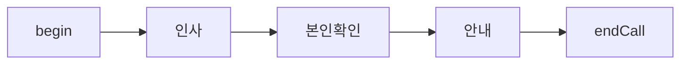
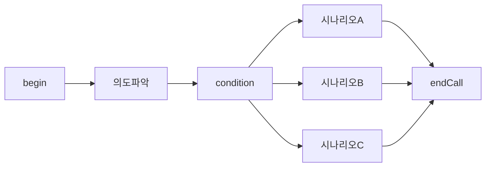
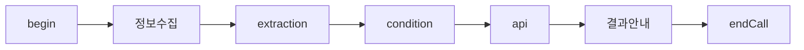
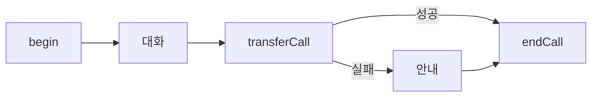

# Flow 설계 통합 가이드

vox.ai flow agent의 구조와 설계 원칙을 이해하기 위한 가이드. flow를 처음 설계하거나, 기존 flow를 수정할 때 읽는다.

## Flow 구조

flow는 **nodes**(노드)와 **edges**(연결)로 이루어진 방향 그래프다.

```
FlowData {
  nodes: FlowNode[]      // 각 노드 (id, type, data, position)
  edges: FlowEdge[]      // 노드 간 연결 (source → target)
  viewport: Viewport      // 에디터 화면 위치/줌
}
```

기본 스키마 → [default-flow-data.json](default-flow-data.json) 참조.

### 노드 (FlowNode)

```
FlowNode {
  id: string              // 고유 ID
  type: NodeType          // begin, conversation, condition, ...
  data: NodeData          // 타입별 설정 (prompt, transitions, ...)
  position: { x, y }     // 에디터 내 위치
}
```

11종 active + 2종 deprecated. 타입별 필드 상세 → `node-types.md` 참조.

### 엣지 (FlowEdge)

```
FlowEdge {
  id: string
  type: "custom"          // 항상 "custom"
  source: string          // 출발 노드 ID
  target: string          // 도착 노드 ID
  sourceHandle?: string   // 출발 노드의 transition ID와 매핑 (begin 노드 제외)
  animated?: boolean      // true면 에디터에서 점선 애니메이션
}
```

**핵심**: `sourceHandle`이 소스 노드의 `transition.id`와 1:1 매핑된다. 이것이 "어떤 조건일 때 어디로 가는가"를 결정한다.

```
[conversation 노드]                    [edge]                     [다음 노드]
  transitions: [                      {
    { id: "tr-1",            ←——→       sourceHandle: "tr-1",
      condition: "예약 원하면" }          source: "conv-1",
  ]                                      target: "booking-1"
                                      }
```

- begin 노드는 transition이 없으므로 edge에 `sourceHandle`이 없다 (`type`과 `animated`만 설정)
- condition 노드는 `logicalTransitions[].id`가 sourceHandle
- fallback transition (`isFallback: true`)은 tool/api/transfer 노드에서 자동 생성

## 전환 조건 (Transitions)

conversation 노드의 전환 조건은 **자연어**로 작성한다. LLM이 대화 컨텍스트를 보고 조건 충족 여부를 판단한다.

### 좋은 전환 조건

- **exit 조건만 정의** — "고객이 예약을 원한다고 했으면" (O)
- **구체적이고 판별 가능** — "고객이 이름과 전화번호를 모두 제공했으면" (O)
- **`{{변수}}`로 데이터 참조 가능** — "{{is_verified}} 가 true이면" (O)

### 피해야 할 전환 조건

- **다음 노드 이름 언급** — "예약 노드로 이동" (X) → 노드 순서가 바뀌면 깨진다
- **모호한 조건** — "대화가 끝나면" (X) → LLM이 판단할 수 없다
- **에이전트 행동 기반** — "안내를 완료하면" (X) → 고객 발화 없이 자동 전환되어 일방통행이 된다

### condition 노드 vs conversation 전환

| | conversation transition | condition 노드 |
|---|---|---|
| 판단 방식 | LLM이 자연어로 판단 | 변수 값을 프로그래밍으로 비교 |
| 사용 시점 | 대화 맥락 기반 분기 | 정확한 값 비교가 필요할 때 |
| 예시 | "고객이 환불을 원하면" | `order_status equals "cancelled"` |

condition 노드의 연산자 종류(equals, contains, exists 등)와 logicalTransitions 상세 → `node-types.md` [condition](#condition) 섹션 참조.

## 변수 흐름

flow에서 변수는 노드 간 데이터를 전달하는 핵심 메커니즘이다.

### 변수 생성

| 방법 | 노드 | 설명 |
|------|------|------|
| system | (자동) | `{{current_time}}`, `{{call_from}}`, `{{call_to}}` 등 플랫폼 제공 |
| agent 설정 | (사전 주입) | `{{customer_name}}` 등 통화 시작 전 주입 |
| extraction | extraction 노드 | LLM이 대화에서 추출 → flow 변수로 저장 |
| api response | api 노드 | JSONPath로 API 응답에서 추출 |

### 변수 소비

| 위치 | 사용법 |
|------|--------|
| conversation prompt | `{{customer_name}}님의 주문을 확인합니다` |
| api URL/body | `https://api.example.com/orders/{{order_id}}` |
| condition 노드 | `order_status equals "delivered"` |
| extraction prompt | `{{customer_name}}의 주문번호를 추출하세요` |
| transferCall warm prompt | `{{customer_name}}님이 환불 요청 중입니다` |

### 일반적인 변수 흐름 패턴

```
conversation → extraction → condition → api → conversation
(정보 수집)   (변수 추출)   (조건 분기)  (조회)  (결과 안내)
```

상세 → `variable-system.md` (vox-agents/references/) 참조.

## 설계 원칙

### 1. 노드 수 최소화

불필요한 분할은 edge 관리를 복잡하게 하고 유지보수 비용이 증가한다. 하나의 conversation 노드가 하나의 목적을 처리하되, 관련된 확인/재질문은 같은 노드의 loopCondition으로 처리한다.

### 2. 한 노드 = 한 목적

각 노드가 하나의 명확한 목적을 가져야 한다. "인사 + 본인확인 + 안내"를 하나에 넣으면 전환 조건이 복잡해지고 디버깅이 어려워진다.

### 3. Global 노드 활용

"통화 종료 요청", "상담원 연결 요청" 같은 어디서든 발생할 수 있는 시나리오는 global node로 설정한다. 모든 노드에 개별 전환을 추가하는 것보다 유지보수가 쉽다.

### 4. Fallback 경로 확보

모든 분기 경로에 fallback이 있어야 한다:
- condition 노드: Else 분기 필수
- api/tool 노드: 실패 시 fallback transition (자동 생성됨)
- conversation 노드: 예상 밖 응답에 대한 전환 조건

### 5. Extraction 전에 Conversation

extraction 노드는 기존 대화 컨텍스트에서 추출한다. 필요한 정보가 대화에 아직 없으면 extraction이 빈 값을 반환한다. 반드시 conversation 노드에서 정보를 수집한 후 extraction을 배치한다.

## 설계 패턴

### Linear (순차)



단순한 안내/공지 시나리오. 분기 없이 순서대로 진행.

### Branching (분기)



고객 의도에 따라 다른 시나리오로 분기. condition 노드 또는 conversation transition으로 분기.

### Data Collection (데이터 수집)



고객 정보 수집 → 변수 추출 → 조건 확인 → 외부 조회 → 결과 안내.

### Transfer Fallback (전환 + 복구)



통화 전환 실패 시 fallback으로 안내 후 종료.

## API로 Flow 수정

REST API는 flow CRUD를 완전 지원한다. `flow_data`에 전체 FlowData 객체를 보내면 된다.

### 생성

```
POST /v2/agents
{
  "name": "My Flow Agent",
  "type": "flow",
  "data": { ... },          // agent.data (vox-agents/references/default-agent-data.json 참조)
  "flow_data": { ... }      // FlowData (default-flow-data.json 참조)
}
```

### 수정

```
PATCH /v2/agents/{id}
{
  "flow_data": {
    "nodes": [...],
    "edges": [...],
    "viewport": { "x": 0, "y": 0, "zoom": 1 }
  }
}
```

`flow_data`는 **replace** 방식 — 전체 노드/엣지를 보내야 한다.

### 조회

```
GET /v2/agents/{id}
```

응답에 `flow_data` 포함.

> **참고**: 현재 MCP tools (`create_agent`/`update_agent`)에는 `flow_data` 파라미터가 없다. MCP를 통한 flow 수정은 아직 불가. REST API를 직접 호출하거나 대시보드를 사용해야 한다.
