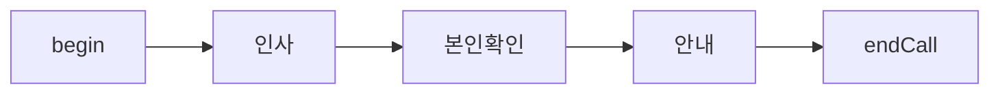
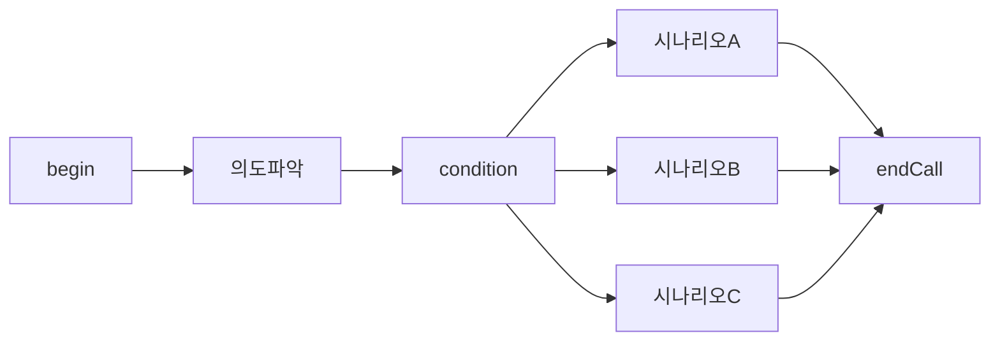
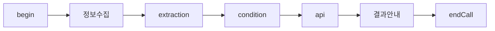
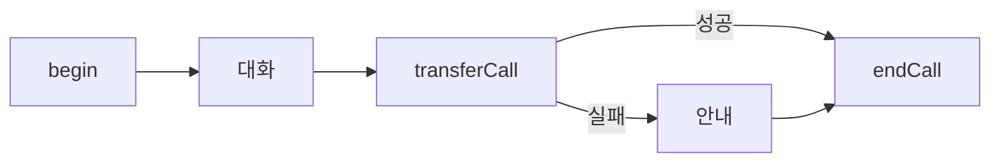

# Flow 설계 통합 가이드

vox.ai flow agent 의 구조와 설계 원칙을 이해하기 위한 가이드. flow 를 처음 설계하거나, 기존 flow 를 수정할 때 읽는다.

본 가이드는 **v3 API / vox.ai MCP `flow_data` workflow** 기준이다. 정확한 node type, data field, enum, required 여부는 문서에 고정하지 않고 MCP schema endpoint 결과를 따른다.

## Schema-first workflow

flow JSON 을 작성하거나 수정할 때는 먼저 현재 schema 를 가져온다.

```text
get_schema(namespace="flow-schema", schema_type="flow-data")
```

agent `data` 도 같이 다루면 필요한 schema 를 별도로 가져온다.

```text
get_schema(namespace="agent-schema", schema_type="agent-data-create")
get_schema(namespace="agent-schema", schema_type="agent-data-update")
```

이 문서와 `node-types.md` 는 설계 원칙과 실수 방지용이다. 실제 payload 는 schema endpoint 응답을 기준으로 만들고, 전송 후 `get_agent` 로 round-trip 확인한다.

## v3 Flow Schema

flow 는 **nodes** (노드 목록) 와 **edges** (연결 목록) 로 이루어진 방향 그래프다.

```
FlowData {
  nodes: FlowNode[]
  edges: FlowEdge[]
}
```

전체 schema 는 **snake_case**. 클라이언트가 unknown 필드를 보내면 서버는 **validation error 없이 silently drop** 한다 (`extra="ignore"`) — 보낸 필드가 응답에 안 보이면 schema 어긋남이다. 응답을 그대로 다시 받아 비교하는 round-trip 검증이 필수.

기본 schema 의 가장 작은 합법 flow → [default-flow-data.json](default-flow-data.json) 참조.

### FlowNode

```
FlowNode {
  id: string                  // flow 안에서 unique. 1..64 chars.
  type: NodeType              // schema endpoint 의 enum 기준
  data: NodeData              // type 별 schema 는 schema endpoint 기준
}
```

- 노드 사이의 분기는 **여기 안에 없음.** 분기는 전부 edge.condition 로 승격됐다 (구 `transitions[]` / `logicalTransitions[]` 모델 폐지).
- `position`, `viewport`, edge id/handle 같은 editor/legacy 메타는 schema endpoint 가 노출할 때만 보낸다. 기억으로 추가하면 silently drop 될 수 있다.
- 모든 노드의 `data` 에는 공통 필드 `name?` (에디터 라벨) 과 `global?: GlobalConfig` (값이 있으면 global node — 어디서든 진입) 이 있다.

### FlowEdge

```
FlowEdge {
  source: string              // 출발 node.id
  target: string              // 도착 node.id
  condition: EdgeCondition    // discriminated union (아래)
  skip_user_response?: bool   // 기본 false
  is_global?: bool            // 기본 false
}
```

- edge 에는 **id 가 없다**. flow 내 unique 키는 `(source, target, condition, skip_user_response, is_global)` 5-tuple.
- `sourceHandle` / `targetHandle` / `type:"custom"` / `animated` 같은 필드는 없다 (구 v2 vox.ai web editor 모델). 보내도 drop.
- `is_global=true` 인 edge 는 global node 의 진입선 — 보통 자동 관리.

### EdgeCondition (분기 본진)

세 종류의 discriminated union. discriminator 키는 `type`.

**(1) AI condition** — LLM 이 자연어 프롬프트로 판단.

```
{ "type": "ai", "prompt": "고객이 예약 의사를 밝힌 경우" }
```

전환 조건을 자연어로 기술. `{{variable}}` 참조 가능. conversation 노드의 out-edge 에서 가장 흔히 쓰이는 형태.

**(2) Logic condition** — 변수 값 기반 결정적.

```
{
  "type": "logic",
  "op": "and" | "or",
  "conditions": [SingleCondition, ...]   // 1 개 이상
}
```

`SingleCondition`:

```
{
  "variable": "order_status",            // extraction / api 노드에서 만든 변수 이름
  "operator": <ConditionOperator>,
  "value": "delivered"                   // exists / does_not_exist 면 생략 가능
}
```

`ConditionOperator` 의 현재 enum 과 `value` 필요 여부는 schema endpoint 결과를 따른다. 로컬 문서에 있는 과거 operator 목록을 기억으로 쓰지 않는다.

**`value` 는 항상 string 으로 보낸다.** number / boolean 직접 보내면 web editor 가 크래시하고, boolean 변수 비교 시 runtime 의 `str()` 비교 케이스 차이로 매치가 실패할 수 있다. 자세한 회피법은 [`hidden-contracts.md` §2](hidden-contracts.md#2-logiccondition-value-는-string--boolean-비교-우회).

condition 노드의 out-edge 에서 주로 쓰임. conversation 노드 out-edge 에도 쓸 수 있음.

**(3) Fallback condition** — 같은 source 노드의 다른 모든 condition 이 매치 안 될 때 default.

```
{ "type": "fallback" }
```

api / tool / begin / condition 등 분기에서 default path 로 자주 사용. 같은 source 노드에 fallback 은 보통 하나만.

### Per-edge 패턴 정리

- **conversation → next**: `condition: {type:"ai", prompt:"…"}` (대화 컨텍스트 기반)
- **condition → branch**: `condition: {type:"logic", op:"and"|"or", conditions:[…]}` 또는 logic 1 개 + fallback 1 개
- **api / tool → success / failure**: 성공 path 는 `{type:"ai"}` 또는 `{type:"logic"}`, 실패 path 는 `{type:"fallback"}`
- **begin → first node**: 보통 `{type:"fallback"}` (begin 에서 분기 X)

## 변수 흐름

flow 에서 변수는 노드 간 데이터를 전달하는 핵심 메커니즘.

### 변수 생성

| 방법 | 노드 | 설명 |
|---|---|---|
| system | (자동) | `{{current_time}}`, `{{call_from}}`, `{{call_to}}` 등 플랫폼 제공 |
| agent 설정 | (사전 주입) | `{{customer_name}}` 등 통화 시작 전 주입 (`agent.data.presetDynamicVariables`) |
| extraction | extraction 노드 | LLM 이 대화에서 추출 → flow 변수로 저장. 변수 정의는 `extraction_configuration.variables[]` 의 `variable_name` / `variable_type` / `variable_description` |
| api response | api 노드 | JSONPath 로 API 응답에서 추출. 매핑은 `response_variables[]` 의 `variable_name` / `json_path` |

### extraction 변수 vs postCall 변수 — 어디에 두느냐

vox.ai 는 통화 중 추출값을 두 곳에 보관할 수 있다. **단순 기록과 분기/발화 사용을 분리** 하지 않으면 extraction 노드만 비대해지고 단순 기록 변수가 쓸데없는 노드 부담을 만든다.

| 항목 | extraction 노드 (flow 변수) | postCall (`agent.data.postCall.actions`) |
|---|---|---|
| **언제** | 추출한 값을 **이후 대화/분기/api/sendSms 등에서 사용** 할 때 | 통화 종료 후 **단순 기록 / 분석 / CRM 적재** 만 할 때 |
| **저장 시점** | 추출 즉시 flow 변수로 즉시 사용 가능 | 통화 종료 후 일괄 저장 (대화 중 사용 불가) |
| **분기 사용** | condition 노드의 `{{variable}}` 비교에 직접 사용 | 사용 불가 |
| **발화 사용** | conversation `{{variable}}` 렌더링 가능 | 사용 불가 |
| **type 옵션** | string / number / boolean | string / number / boolean / **enum** (`enumOptions` 필수) |
| **노드 필요** | extraction 노드 추가 필요 | 노드 추가 불필요 |

**판단 흐름**:
1. 추출한 값을 이후 conversation prompt 에 넣을 건가? → extraction
2. condition 또는 logic edge 에서 `{{variable}}` 비교할 건가? → extraction
3. api 호출의 url / body / headers 에 넣을 건가? → extraction
4. 위 셋 다 아니라면 → **postCall**. 통화 종료 후 분석/CRM 용으로만 쓰는 값.

**예시**:
- `cancel_reason` (취소 사유 — 통화 후 분석만) → postCall ✅
- `new_datetime` (변경 일시 — 다음 노드의 conversation 에서 발화) → extraction ✅
- `member_grade` (회원 등급 — condition 노드의 logic 분기에서 사용) → extraction ✅
- `feedback_text` (자유 답변 — 통화 후 검토만) → postCall ✅
- `wants_consultation` (상담 희망 — branch 노드에서 사용) → extraction ✅

postCall 의 정확한 schema 와 enum 처리는 `vox-agents/references/agent-data-reference.md` 의 postCall 섹션을 참조한다.

### 변수 소비

| 위치 | 사용법 |
|---|---|
| conversation `data.message.content` | `{{customer_name}}님의 주문을 확인합니다` |
| api `data.api_configuration.url` / `body` | `https://api.example.com/orders/{{order_id}}` |
| edge `condition.prompt` (ai) / `conditions[].variable` (logic) | `{{is_verified}} 가 true 인 경우` 등 |
| extraction `data.extraction_configuration.extraction_prompt` | `{{customer_name}} 의 주문번호를 추출하세요` |
| transferCall `data.warm_transfer_prompt` | `{{customer_name}} 님이 환불 요청 중입니다` |
| sendSms `data.prompt` (dynamic) / `data.static_sentence` (static) | `{{customer_name}}님 예약이 확정되었습니다` |

### 일반적인 변수 흐름 패턴

```
conversation → extraction → condition → api → conversation
(정보 수집)   (변수 추출)   (조건 분기)  (조회)  (결과 안내)
```

상세 → `variable-system.md` (vox-agents/references/) 참조.

## 설계 원칙

### 1. 노드 수 최소화

불필요한 분할은 edge 관리를 복잡하게 하고 유지보수 비용이 증가한다. 한 conversation 노드가 한 목적을 처리하되, 관련된 확인/재질문은 같은 노드의 `loop_condition` 으로 처리한다.

### 2. 한 노드 = 한 목적

각 노드가 하나의 명확한 목적을 가져야 한다. "인사 + 본인확인 + 안내" 를 하나에 넣으면 전환 조건이 복잡해지고 디버깅이 어려워진다.

### 3. Global 노드 활용

"통화 종료 요청", "상담원 연결 요청" 같이 어디서든 발생할 수 있는 시나리오는 global node 로 설정한다. 모든 노드에 개별 전환을 추가하는 것보다 유지보수가 쉽다. 활성화 = `data.global` 에 `{enter_condition: "…"}` 를 넣는다 (값이 없으면 global 아님).

### 4. Fallback 경로 확보

모든 분기 source 노드에 fallback edge 가 있어야 한다:
- condition 노드: 모든 logic edge 외에 `{type:"fallback"}` edge 1 개.
- api / tool 노드: 성공 path 외에 `{type:"fallback"}` edge 1 개 (호출 실패 시 진행).
- conversation 노드: 예상 외 응답 path. 보통 `{type:"ai", prompt:"고객이 거절했거나 통화를 끊으려는 경우"}` 식.
- begin 노드: 단일 fallback edge 1 개 (분기 없음).

### 5. Extraction 전에 Conversation

extraction 노드는 기존 대화 컨텍스트에서 추출한다. 필요한 정보가 대화에 아직 없으면 extraction 이 빈 값을 반환한다. 반드시 conversation 노드에서 정보를 수집한 후 extraction 을 배치한다. extraction 은 `data.is_skip_user_response: true` 가 기본이라 사용자 응답을 기다리지 않는다.

### 6. Condition 노드는 logic 분기 전용

condition 노드의 `data` 에는 `name` / `global` 외 어떤 분기 필드도 들어가지 않는다. 분기는 100% out-edge 에 위치 — `condition: {type:"logic", op:..., conditions:[...]}` edge 여러 개 + 마지막에 `{type:"fallback"}` edge 1 개.

## 설계 패턴

### Linear (순차)



분기 없이 순서대로 진행. 각 edge 는 보통 `{type:"ai", prompt:"…"}` 또는 conversation 사이라면 default path 의 `{type:"fallback"}`.

### Branching (분기)



고객 의도에 따라 다른 시나리오로 분기. condition 노드 또는 conversation 의 out-edge 에서 ai-condition 으로 분기.

### Data Collection (데이터 수집)



고객 정보 수집 → 변수 추출 → 조건 확인 → 외부 조회 → 결과 안내.

### Transfer Fallback (전환 + 복구)



통화 전환 실패 시 fallback edge 로 안내 후 종료.

## API / MCP 로 Flow 만들고 수정

vox.ai MCP 와 v3 REST 모두 동일한 `flow_data` schema 를 받는다. **수정은 전체 교체 (full replacement)** — 기존 nodes / edges 일부만 patch 하는 모드는 없다. PATCH 시에도 nodes / edges 전체를 다시 보낸다.

작업 순서:

1. `get_schema(namespace="flow-schema", schema_type="flow-data")` 로 현재 flow schema 를 확인한다.
2. agent `data` 를 보낼 경우 `get_schema(namespace="agent-schema", schema_type="agent-data-create")` 또는 `agent-data-update` 를 확인한다.
3. `create_agent(type="flow", data=..., flow_data=...)` 또는 `update_agent(flow_data=...)` 를 호출한다.
4. `get_agent` 로 다시 읽어 unknown field drop, enum mismatch, 누락 edge 를 확인한다.

### 생성 (REST 또는 MCP)

REST:
```
POST /v3/agents
{
  "name": "My Flow Agent",
  "type": "flow",
  "data": { ... },          // agent.data (vox-agents/references/default-agent-data.json)
  "flow_data": { "nodes": [...], "edges": [...] }
}
```

vox.ai MCP (Claude Code 등 client 에서 호출):
```
mcp__vox__create_agent(
  name="My Flow Agent",
  type="flow",
  data={ ... },
  flow_data={ "nodes": [...], "edges": [...] }
)
```

### 수정

REST:
```
PATCH /v3/agents/{id}
{
  "flow_data": { "nodes": [...], "edges": [...] }
}
```

vox.ai MCP:
```
mcp__vox__update_agent(
  agent_id="<UUID>",
  flow_data={ "nodes": [...], "edges": [...] }
)
```

전체 nodes / edges 다시 보내는 형태. 일부만 빼면 그 노드/엣지가 삭제된다.

#### PATCH 직전 사용자 수정분 보존 (필수)

flow_data 는 **전체 교체** 이지만, 사용자가 web editor 에서 직접 추가/수정한 노드·엣지가 server 에 보존되어 있을 수 있다. 이전 버전으로 PATCH 하면 **사용자 작업이 silent 로 삭제** 된다.

작업 순서:

1. `get_agent(agent_id=...)` 으로 현재 flow_data 조회
2. 응답의 nodes / edges 를 우리가 만들 nodes / edges 와 diff
3. 사용자가 추가한 (id 가 우리 의도에 없는) 노드/엣지는 **그대로 보존** 한 채 PATCH
4. PATCH 후 `get_agent` 재호출해 round-trip 검증

사용자 추가 엣지는 형식이 우리 형식과 다를 수 있다 — 빈/짧은 ai prompt 또는 `condition.type="fallback"` + `skip_user_response=false` 식. 둘 다 schema 가 받아주는 정상 형식이므로 형식 통일 시도하지 말고 그대로 둔다. 자세한 contract 는 [`hidden-contracts.md` §6](hidden-contracts.md#6-flow_data-patch-시-사용자-web-editor-수정분-보존).

### 조회

REST:
```
GET /v3/agents/{id}    # 응답에 flow_data 포함
```

vox.ai MCP:
```
mcp__vox__get_agent(agent_id="<UUID>")   # 응답에 flow_data 포함
```

### Round-trip 검증 (필수)

`flow_data` 는 unknown 필드를 silent drop 할 수 있고, 일부 필드는 server 가 **silently override** 한다 (예: `begin → next` 의 condition / skip_user_response). 전송 후 항상 응답을 다시 비교해서 다음을 확인한다.

체크리스트:

1. **보낸 필드가 응답에 모두 살아있나** — 누락은 schema 어긋남 (extra 필드 silent drop) 신호. 로컬 문서가 아니라 schema endpoint 결과로 다시 대조.
2. **`skip_user_response` default override 됐나** — extraction / api 등 응답 비기대형 노드의 outgoing edge 에 `true` 로 보냈는데 응답이 `false` 면 데드락 위험 ([`hidden-contracts.md` §1](hidden-contracts.md#1-응답-비기대형-노드의-outgoing-transition-skip_user_responsetrue)).
3. **`condition.type` 이 의도한 값으로 저장됐나** — `begin → next` 는 `ai` 보내도 `fallback` 으로 강제됨. 다른 노드는 보낸 값 그대로여야 함.
4. **사용자 web editor 수정분이 살아있나** — PATCH 라면 우리가 보내지 않은 (id 가 우리 의도에 없는) 노드/엣지가 응답에 살아있어야 함. 사라졌으면 사용자 작업을 덮어쓴 것 ([`hidden-contracts.md` §6](hidden-contracts.md#6-flow_data-patch-시-사용자-web-editor-수정분-보존)).
5. **fallback edge 가 web editor 시각화에 안 보인다는 보고가 들어오면** — 응답 데이터에는 정상이면 web editor 렌더링 버그 ([`hidden-contracts.md` §4](hidden-contracts.md#4-edge--transition-매칭은-sourcehandle--transitionid)). 데이터에서 빠졌으면 schema 어긋남.

이 체크리스트를 12 항목 self-check ([`hidden-contracts.md` 빠른 self-check](hidden-contracts.md#빠른-self-check)) 와 함께 PATCH 의 사후 점검 루틴으로 사용한다.
