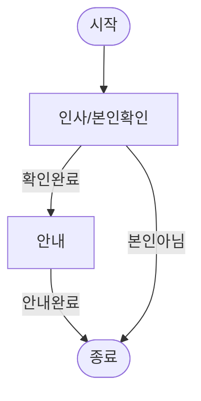
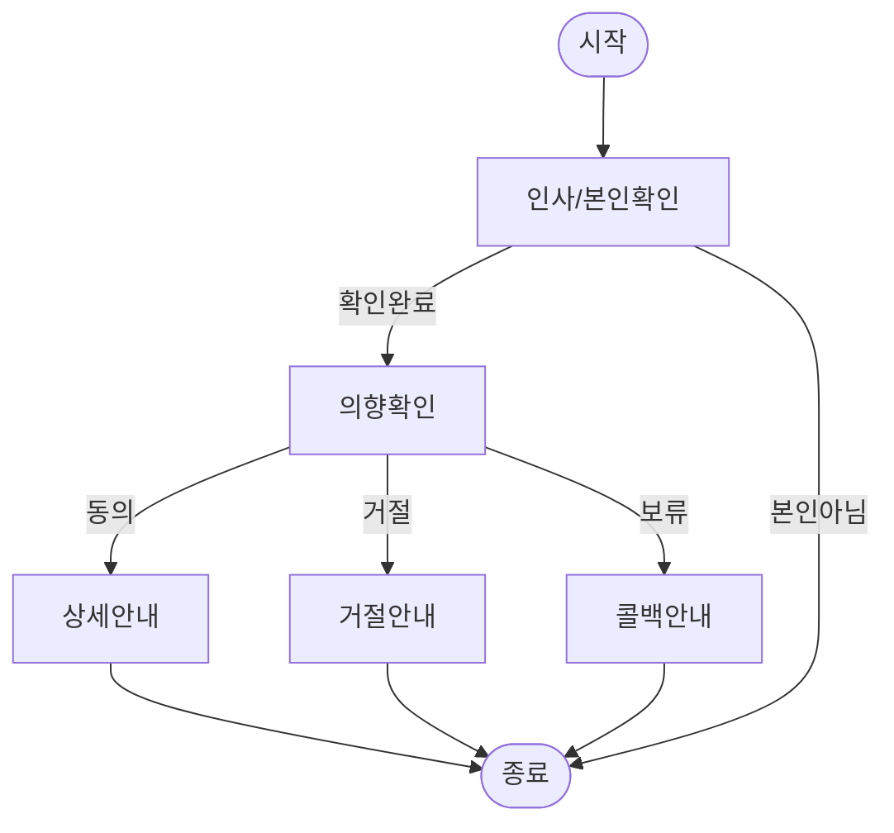
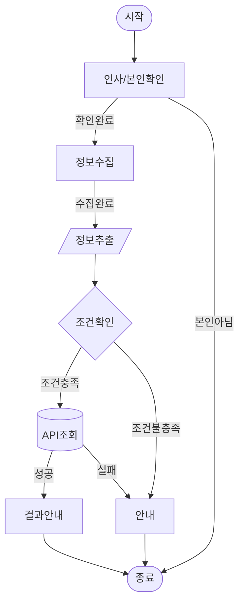
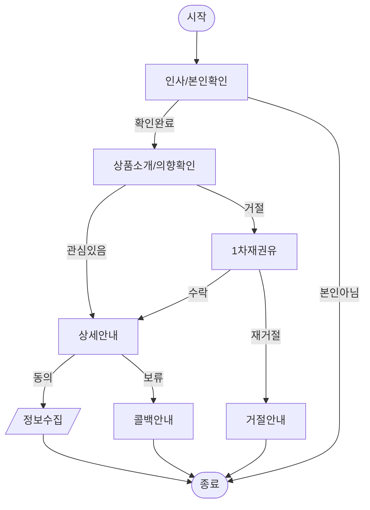
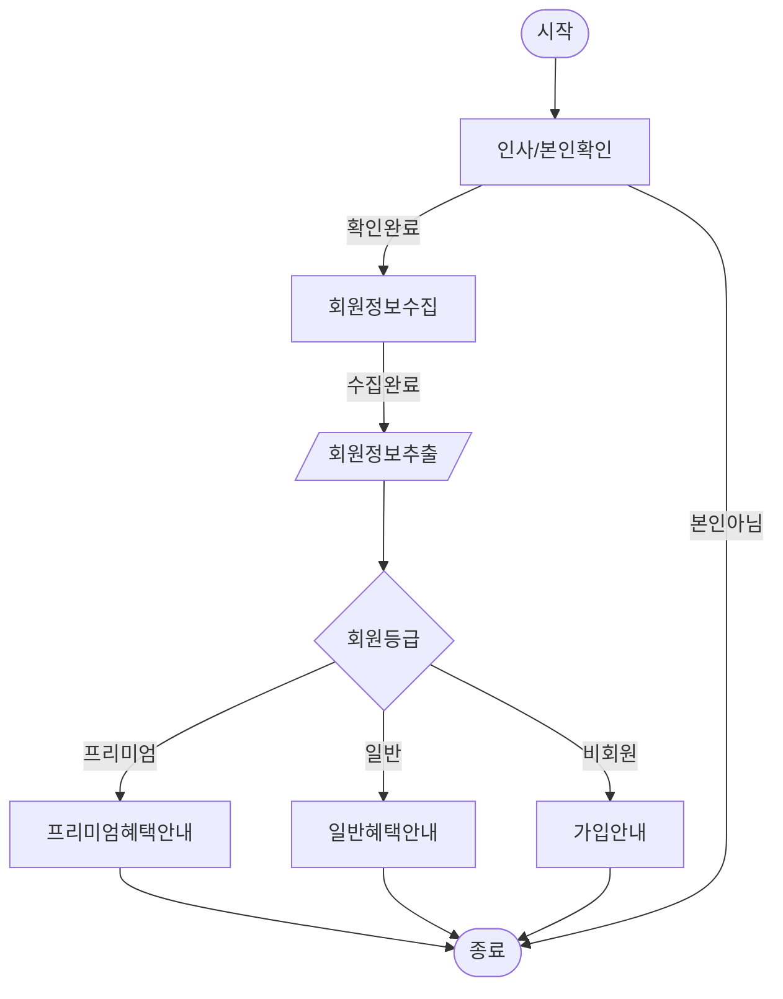
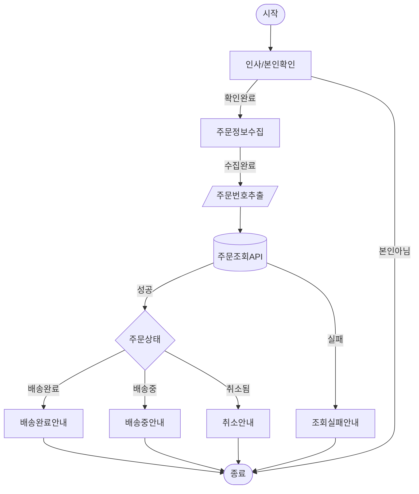
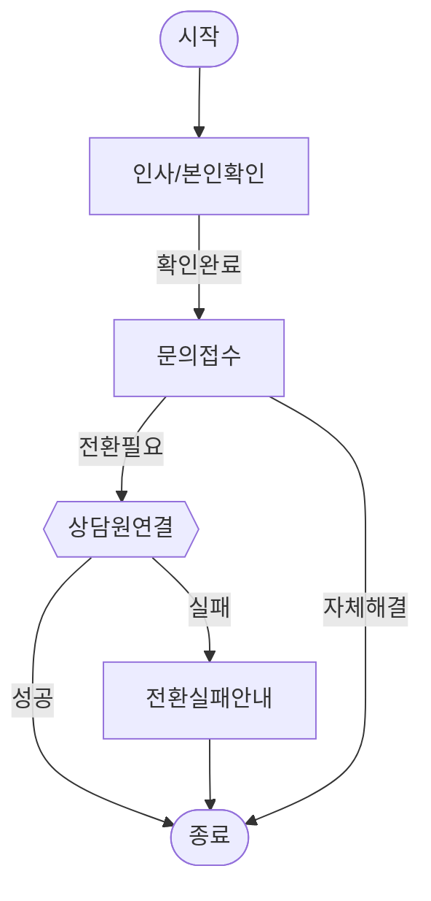
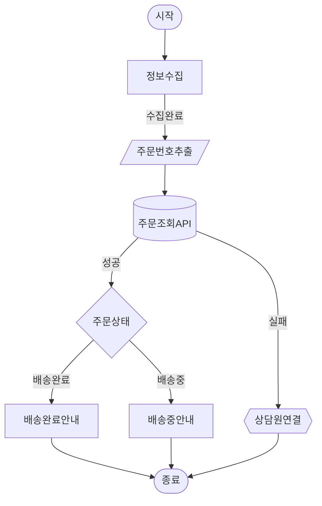

# Flowsketch: 스크립트 → Mermaid 시각화

콜센터/OB/CS 스크립트를 Mermaid flowchart + 노드 요약 테이블로 변환한다. flow 설계의 첫 단계로, 전체 뼈대를 시각화하고 피드백으로 다듬는다.

## 목차

- [입력](#입력)
- [출력](#출력)
- [작업 절차](#작업-절차) — 1 분석 → 2 노드 도출 → 3 Mermaid → 4 테이블 → 5 핸드오프 → 6 피드백
- [패턴 라이브러리](#패턴-라이브러리) — Linear / Branching / Data Collection / Multi-stage Sales / Extraction→Condition / API→Condition / Transfer / API Success-Failure
- [운영 규칙](#운영-규칙)

## 입력

- **스크립트 텍스트**: 대화에 직접 붙여넣은 스크립트
- **스크립트 파일**: .txt, .md, .docx, .pdf
- **부가 정보** (있으면): 필수 수집 항목, 분기 조건, 운영 제약, `{{...}}` 변수

스크립트만 주고 나머지를 생략하면 추론 가능한 것은 추론한다. 추론 불가능한 핵심 사항은 짧게 질문하되 최대 2개 제한.

## 출력

대화에 직접 출력한다. 파일은 만들지 않는다. 3가지를 순서대로 출력:

### 1. Mermaid Flowchart

하이레벨 구조 — 노드 이름과 분기 흐름만 보여준다.

### 2. 노드 요약 테이블

| 노드 이름 | 타입 | 목적 | 주요 전환조건 |
|-----------|------|------|-------------|

- **노드 이름**: 차트의 노드 이름과 일치
- **타입**: conversation / extraction / condition / api / endCall 등
- **목적**: 한 줄
- **주요 전환조건**: exit 조건을 쉼표로 나열. extraction 노드는 "자동 전환"으로 표기.

### 3. 핸드오프 메모 (2단계용)

2단계(node-creation)에 넘길 정보를 정리한다. 상세 포맷은 작업 절차 5단계 참조.

## 작업 절차

### 1단계: 스크립트 분석

스크립트를 읽고 파악:
1. 대화의 전체 목적 (세일즈/CS/예약/안내/회수 등)
2. 주요 분기점 — 고객 응답에 따라 갈라지는 지점
3. 각 구간의 목적 (인사, 본인확인, 정보수집, 안내, 마무리 등)
4. `{{...}}` 런타임 변수
5. 예외 처리 필요 구간 (거절, 보류, 오대상, 이미 처리됨 등)

### 2단계: 노드 도출

스크립트를 논리적 단위로 쪼갠다:
- **한 노드 = 고객에게 1가지 목적을 달성하는 최소 단위**
- 밀접하게 붙어 분리하면 부자연스러운 경우 합침
- 고객 응답에 따라 다른 경로로 가야 하는 지점이 노드 경계
- 일방적 안내(고객 응답 불필요)는 별도 노드로 분리

노드 타입 판단 기준 (스크립트 구간 → 노드 타입 매핑):

| 구간 성격 | 추천 노드 타입 | 비고 |
|----------|--------------|------|
| 대화/질문/응답 | conversation | |
| 정보 추출 (이름, 번호 등) | extraction | 보통 사용자 응답을 기다리지 않고 다음 edge 로 진행 — 대화형 노드가 아님 |
| 변수 기반 분기 | condition | |
| 외부 API 호출 | api | |
| 도구 실행 | tool | |
| 상담원 전환 | transferCall | |
| 다른 에이전트로 전환 | transferAgent | |
| 일방적 안내 후 종료 | endCall | |
| 일방적 안내 후 계속 | conversation (static, 사용자 응답 대기 없음) | |

노드 타입 선택 기준은 [node-types.md](node-types.md)를 참조한다. JSON field/enum/required 여부는 MCP schema endpoint 결과를 따른다.

#### conversation vs condition — 가장 중요한 구분

이 둘을 혼동하면 Mermaid 모양도 틀리고, 실제 flow 설계에서도 노드 타입을 잘못 선택하게 된다.

**conversation** `[]` — 고객과 대화하는 노드. 에이전트가 말하고, 고객이 응답하고, LLM이 그 응답을 해석해서 전환을 판단한다. 판단 주체가 **LLM**이다.

**condition** `{}` — 대화가 없는 노드. 이미 추출된 변수 값을 시스템이 기계적으로 비교해서 분기한다. 판단 주체가 **시스템**이다.

| 질문 | conversation `[]` | condition `{}` |
|------|-------------------|----------------|
| 고객과 대화하나? | 대화한다 | 대화 없다 |
| 분기 기준이 뭔가? | 고객이 뭐라고 말하느냐 | 변수 값이 뭐냐 |
| 판단 주체는? | LLM | 시스템 (operator 비교) |
| 앞에 뭐가 오나? | begin, 다른 conversation 등 | extraction, api (변수가 먼저 존재해야) |

**흔한 실수**: "고객이 동의하면 A, 거절하면 B"를 condition `{}`으로 그리는 것. 이건 고객 발화를 LLM이 해석하는 것이므로 conversation `[]`이 맞다. condition은 `is_member == true`처럼 이미 추출된 변수를 비교할 때만 쓴다.

#### extraction + condition 조합

대화에서 정보를 수집한 뒤, 추출된 변수 값에 따라 분기해야 할 때 사용한다.

흐름: conversation(수집) → extraction(추출) → condition(변수 분기)

```
conversation [회원정보확인]  "고객님, 성함과 회원번호를 말씀해주시겠어요?"
    ↓
extraction  [/회원정보추출/]  customer_name, membership_number 추출
    ↓
api         [(회원조회)]      membership_number로 API 호출 → member_grade 추출
    ↓
condition   {회원등급확인}    member_grade == "premium" / "basic" / does_not_exist
    ↓               ↓              ↓
[프리미엄안내]  [일반안내]    [비회원안내]
```

핵심: extraction이나 api가 **먼저** 변수를 만들어야 condition이 그 변수를 비교할 수 있다. 변수 없이 condition을 쓰면 안 된다.

#### api + condition 조합

외부 시스템에서 데이터를 조회한 뒤, 응답 값에 따라 분기해야 할 때 사용한다.

흐름: conversation/extraction → api(조회) → condition(응답 분기)

```
extraction  [/주문번호추출/]  order_number 추출
    ↓
api         [(주문조회)]      order_number로 API 호출 → order_status, delivery_date 추출
    ↓
condition   {주문상태확인}    order_status == "delivered" / "in_transit" / "cancelled"
    ↓               ↓              ↓
[배송완료안내]  [배송중안내]    [취소안내]
```

핵심: api 노드의 responseVariables(JSONPath)로 추출한 변수를 condition이 소비한다. api가 실패하면 fallback edge로 빠지므로, condition까지 도달했다면 변수가 존재한다고 보장된다.

### 3단계: Mermaid Flowchart 작성

```
flowchart TD
    시작노드 -->|전환조건라벨| 다음노드
```

#### 노드 모양 규칙 (반드시 준수)

모양만으로 노드 타입을 즉시 구분할 수 있어야 한다. 아래 매핑을 예외 없이 적용한다.

| 노드 타입 | Mermaid 문법 | 모양 | 시각적 의미 |
|----------|-------------|------|-----------|
| begin | `A([시작])` | stadium | 흐름의 시작 |
| conversation | `B[대화노드]` | rectangle | 고객과 대화 |
| extraction | `C[/변수추출/]` | parallelogram | 데이터 추출 |
| condition | `D{조건분기}` | diamond | 예/아니오 판단 |
| api | `E[(API호출)]` | cylinder | 외부 데이터 |
| tool | `F[[도구실행]]` | subroutine | 시스템 실행 |
| endCall | `G([종료])` | stadium | 흐름의 끝 |
| transferCall | `H{{상담원연결}}` | hexagon | 외부 전환 |
| transferAgent | `I{{에이전트전환}}` | hexagon | 내부 전환 |

**모양을 섞어 쓰지 않는다.** conversation에 `{}` 쓰거나, condition에 `[]` 쓰면 안 된다.

#### 엣지 라벨 규칙

- 전환조건은 짧은 키워드 — 2~5단어 이내
- 긍정 흐름은 왼쪽/아래, 거절/예외는 오른쪽으로 배치
- 라벨 예: `의향있음`, `거절`, `본인아님`, `이미수검`, `일정확정`, `변경요청`

#### 레이아웃 원칙

- 메인 흐름(happy path)은 위→아래(TD)로 일직선
- 거절/예외/종료 분기는 오른쪽으로 빠지도록 배치
- 노드가 10개 이상이면 subgraph로 단계별 그룹핑 고려

#### Mermaid 주의사항

1. 노드 ID는 영문 알파벳으로 (A, B, C...). 한글은 라벨에만 사용
2. 라벨에 특수문자(`(`, `)`, `[`, `]` 등)가 들어가면 큰따옴표로 감싼다
3. subgraph 사용 시 `end` 키워드 빠뜨리지 않기
4. 같은 종료 노드로 가는 여러 엣지가 있으면 하나의 endCall 노드로 합친다
5. 자기 자신으로 돌아가는 루프는 화살표로 표현: `B -->|재시도| B`

### 4단계: 노드 요약 테이블 작성

Mermaid 차트 아래에 테이블 작성 (출력 섹션의 포맷 참조).

### 5단계: 핸드오프 메모 작성 (2단계용)

2단계(node-creation)에서 필요한 정보를 명시적으로 정리한다. 분석 과정에서 파악한 정보가 출력에 빠지면 2단계에서 원본 스크립트를 다시 참조하거나 사용자에게 재질문해야 하므로, 여기서 넘겨준다.

```
### 핸드오프 메모 (2단계용)
- 수집 변수: [extraction 노드에서 추출할 변수 목록 — 예: customer_name (string), order_id (string)]
- agent 변수 (에이전트 설정 필요): [원본 스크립트의 {{...}} 변수 — 예: {{customer_name}}, {{product_name}}]
- 재시도 제한: [재권유/재확인 최대 횟수 — 예: 재권유 최대 2회 (인사/본인확인 노드)]
- 운영 제약: [파악된 운영 제약 — 예: 한 턴 한 질문, 통화시간 3분 이내. 없으면 "없음"]
```

수집 변수와 agent 변수가 없으면 "없음"으로 표기한다. 추론한 항목은 "(추론)" 표시를 붙인다.

### 6단계: 피드백 수렴 및 개선

차트, 테이블, 핸드오프 메모를 보여준 뒤 3가지 질문:
1. **빠진 분기**: "스크립트에서 빠진 분기나 예외 케이스가 있나요?"
2. **노드 합치기/쪼개기**: "합쳐야 할 노드나 더 쪼개야 할 노드가 있나요?"
3. **전환조건 수정**: "전환조건 라벨 중 수정이 필요한 게 있나요?"

피드백을 받으면 차트와 테이블을 함께 업데이트한다. 부분 수정이면 변경된 부분만 설명하고 전체를 다시 출력한다.

## 패턴 라이브러리

### Linear (순차 진행)

> `([])` begin/end, `[]` conversation

### Branching (의도 분기)

> `([])` begin/end, `[]` conversation
> 주의: 의향확인은 고객 발화를 LLM이 해석하므로 conversation `[]`이다. `{}`가 아니다.

### Data Collection (정보 수집 후 처리)

> `([])` begin/end, `[]` conversation, `[//]` extraction, `{}` condition, `[()]` api

### Multi-stage Sales (다단계 세일즈)

> `([])` begin/end, `[]` conversation, `[//]` extraction

### Extraction → Condition (변수 추출 후 분기)

> `[]` conversation → `[//]` extraction → `{}` condition
> 핵심: extraction이 변수를 만든 뒤에야 condition이 분기할 수 있다

### API → Condition (외부 조회 후 분기)

> `[]` conversation → `[//]` extraction → `[()]` api → `{}` condition
> 핵심: api 실패 시 fallback으로 빠지고, 성공해야 condition에 도달

### Transfer Fallback (상담원 전환)

> `([])` begin/end, `[]` conversation, `{{}}` transferCall

### API Success / Failure 분리 (외부 호출 + 실패 복구)

> `([])` begin/end, `[]` conversation, `[//]` extraction, `[()]` api, `{}` condition, `{{}}` transferCall
> 핵심: api 노드의 outgoing 은 두 갈래로 — **성공 path 는 변수 채워짐 가정의 condition / 다음 conversation**, **실패 path 는 fallback edge 로 전환 또는 안내**. fallback edge 한 줄로 합쳐서 단일 출구만 두지 않는다.

## 운영 규칙

1. 차트와 테이블은 항상 함께 출력한다 — 하나만 출력하지 않는다
2. 스크립트에 없는 분기를 임의로 추가하지 않는다. 추론 가능한 기본 예외(본인아님, 통화불가 등)만 추가하되 별도로 안내한다
3. 노드 이름은 한국어로, 4~8자 이내로 간결하게 작성한다 — Mermaid 차트에서 노드가 비대해지면 레이아웃이 깨지고 한눈에 파악이 어렵다
4. 피드백 반영 후 항상 전체 차트를 다시 출력한다 (diff만 보여주면 전체 맥락을 잃는다)
5. 확정된 차트를 기반으로 [node-creation.md](node-creation.md)로 상세 설계를 이어갈 수 있음을 안내한다
